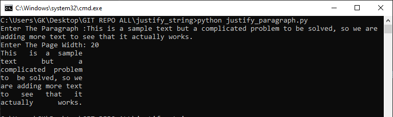

## justify_string
This repository contains a Python program to justify paragraphs by splitting them into lines with left and right justification. It also includes unit tests to ensure the correctness of the justification algorithm.

## Program Description
The `justify_paragraph.py` file contains a Python function `justify_paragraph(paragraph, page_width)` that accepts a paragraph string and a page width as parameters. It then returns an array of left and right justified strings, ensuring that words are not broken when wrapping lines.

## How To Use
To use the program, follow these steps:

1. Clone the repository to your local machine.
2. Navigate to the repository directory.
3. Run the program using the command `python justify_paragraph.py`.
4. Enter the paragraph string and page width when prompted.
5. View the left and right justified strings generated by the program.

## How to Execute The Unit Tests

1. Navigate to the Directory:
2. The repository includes unit tests to verify the correctness of the `justify_paragraph` function. To run the unit tests, execute the command `python -m unittest test_paragraph_justification.py`. The test results will be displayed in the console.
3. Test Results:
    - Each test case will be marked as **"OK"** if it passes or **"FAIL"** if it fails along with additional inforamt if available.

## File Structure
- `justify_paragraph.py`: Contains the main program code for justifying paragraphs.
- `test_paragraph_justification.py`: Contains unit tests for the `justify_paragraph` function.
- `README.md`: This file, providing information about the repository.

## Sample Output:
For example, after entering the following paragraph and page width:

